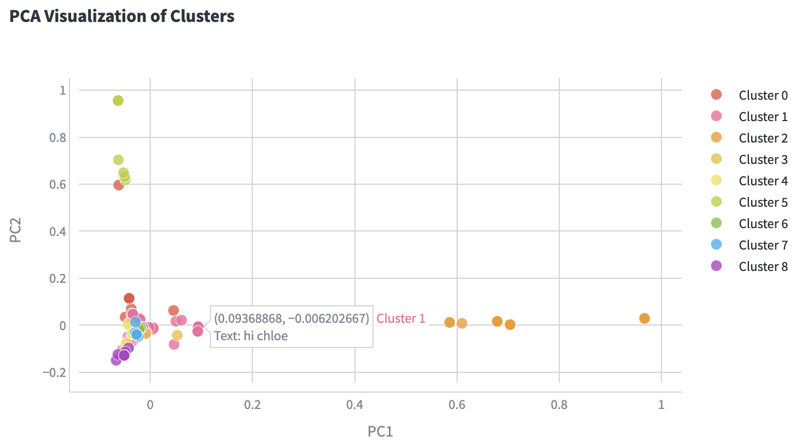

# Ancient Roman Graffiti Analysis Web App

### Overview

Ancient Roman graffiti, especially from Pompeii and Herculaneum, is a fascinating look into the lives of everyday people long lost to history. This project dives into a dataset of graffiti inscriptions—Latin and Greek texts captured on walls, interpreted by scholars, and partially filled in with machine-predicted translations. The result is an interactive exploration of these ancient voices, where you can see what they wrote and what themes emerge.

The app uses natural language processing (NLP) techniques to fill gaps in incomplete texts, translating the broken Latin and Greek words into English as best as possible. While modern NLP tools work best with well-documented languages, analyzing Latin and Greek poses unique challenges. With incomplete phrases and missing context, translation accuracy is limited, and results may not always make perfect sense. Even so, this project remains an exciting exploration into ancient texts, using technology to revive voices from the past.

Explore the app here: https://fisher-c-graffiti--topic-modeling-yrc7z0.streamlit.app/

### Key Features
**1. Topic Modeling:**

The app employs NLP techniques to perform topic modeling on the graffiti text, revealing themes and patterns in the writings of ancient Romans. Users can explore the results of the topic modeling, including the most significant words and phrases associated with each topic, to gain a deeper understanding of the concerns and interests of the people who lived in Pompeii and Herculaneum.

**2. Data Exploration:**
The app allows users to scroll through and inspect the dataset at different stages of data preprocessing stages.

**3. Interactive Visualizations:**
Most graphs are interactive--allowing users to zoom in and out and explore the specific contents of interest.

Hover over the dots in the PCA plot to see where each piece of graffiti falls based on the analysis, with translations displayed for each point:

### Installation

To run this app on your local machine:

1. Clone this repository: `git clone https://github.com/fisher-c/graffiti.git`
2. Install the required libraries using `pip install -r requirements.txt`
3. Run the app using `streamlit run 📝_Topic_Modeling.py`